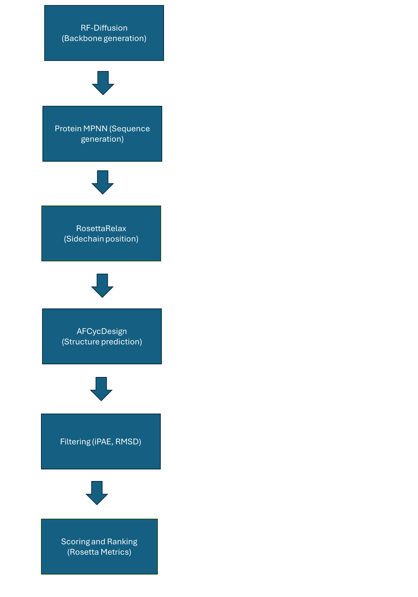

# Prosculpt_AFCycDesign
Prosculpt_AFCycDesign runs the RFpeptides protocol, which is a protocol aimed specifically at the de novo generation of cyclic peptides. Prosculpt_AFCycDesign is inherited from prosculpt (see https://github.com/ajasja/prosculpt) which executes a protocol that is merely aimed at generating linear peptides de novo. The principal code modification consists of replacing AF2 with AFCycDesign.


## Description 
The script `rfdiff_mpnn_af2_merged.py` executes the RFpeptides protocol (see https://www.nature.com/articles/s41589-025-01929-w). This protocol runs a pipeline that starts with the generation of cyclic peptide backbones by RFDiffusion. Thereafter, sequences are generated by ProteinMPNN. The structures of the sequences are obtained using rosetta, by threading the sequence onto the corresponding backbone. Finally, the structures are evaluated by AFCycDesign. Peptides are filtered first by iPAE and RMSD and later by Rosetta metrics like SAP score, CMS and interface ΔΔG. The main steps of Prosculpt_AFCycDesign are as follows:

The main steps are as follows:
1.	The input is a yaml file that contains the folder of the pdb file of the target protein. Furthermore, this yaml file specifies how to generate the new structure around the target protein (which parts to keep, etc.).
2.	RFDiffusion generates new peptide backbones (backbone atoms only) based on the options provided.
3.	Generated PDB files are preprocessed by the usage of helper scripts and ProteinMPNN generates sequences for these structures.
4.	Rosetta maps the ProteinMPNN generated sequences onto the RFDiffusion backbone to generate a structure.
5.	This structure serves as an input for AFCycDesign; AFCycDesign evaluates this structure and provides an updated structure in combination with metrics (iPAE and interface-RMSD) that predict binding.
6.	All peptides are preserved (even the poor performing ones) and a separate folder is created that stores peptides that pass the threshold values of the iPAE and the interface-RMSD.
7.	A second filtering step can be performed using the SAP score and interface ΔΔG. After the second filtering step, peptide structures can be ranked based on how they score on the following metrics: interface ΔΔG, iPAE, pLDDT and CMS.
8.	All the passed peptides, together with their corresponding scores, are compiled into a CSV file. 


## Requirements  
The script assumes that RFdiffusion, ProteinMPNN, and Colabdesign are already installed and that the correct paths are provided in the installation.yaml config file. Additionally biopython, hydra-core, pandas, scipy and pyRosetta are required. For running tests, Python version must be >= 3.7.

## Installation
The easiest way to install prosculpt is using a container manager like [apptainer](https://apptainer.org/) (or singularity). To do so, follow the following instructions

Begin by cloning prosculpt:
```bash
git clone https://github.com/dirkjanotterspeer2001-glitch/AFCycDesign.git
cd AFCycDesign
```
Create a new environment called using python or any venv manager and activate it:
```bash
python -m venv prosculpt_venv/
source prosculpt_venv/bin/activate
```
Install the necessary packages and its dependencies
```bash
pip install .
```
Install pyrosetta into the environment
```bash
pip install pyrosetta-installer 
python -c 'import pyrosetta_installer; pyrosetta_installer.install_pyrosetta()'
```
At a location of your choice download the appropriate SIF files, executing the following commands:
```bash
singularity pull rfdiff.sif docker://rosettacommons/rfdiffusion
singularity pull proteinmpnn.sif docker://rosettacommons/proteinmpnn
singularity pull colabfold.sif docker://unionbio/colabfold:w4KMVR7WrKDlCbdQ1BYrjQ-test
singularity pull pymol.sif docker://jysgro/pymol:3.1.0_amd_arm
singularity pull colabdesign_latest.sif docker://openzyme/colabdesign:latest
```
Go into prosculpt/config/installation.yaml and replace the default values with the ones corresponding to your system. Mainly:
- Replace the run command of the sif files with the appropriate commands and paths for your system.
- Replace the prosculpt_python_path with the python path of your prosculpt env (You can get it by running "which python" with the env active)
- Replace the slurm options with those that correspond with your cluster (these can then be overwritten by individual job settings)

Now we will run a single test, to allow colabfold to download the weights by executing: (This step uses slurm. If your system doesn't use slurm, just run prosculpt by yourself once)
```bash
python run_tests.py -t unconditional
```
After this has succesfully ran, you can run all tests by executing:
```bash
python run_tests.py
```

After all tests are finished, go into the Examples/Examples_out_{yourdatetime} and check the output txt file to verify all tests have passed. 

## Usage

To run Prosculpt_AFCycDesign on Slurm, use the script slurm_runner.py passing it an input yaml file with the job options (e.g. job_parameters.yaml). Note that slurm_runner no longer supports passing arguments in line with the exception of ++output_folder.
```bash
python slurm_runner.py job_parameters.yaml
```


## Inputs: 
Most input parameters are documented in the examples, as well as the `run.yaml` config file. However, here's some additional info about them:

- `pdb_path`: path to pdb structure of the target protein 
- `contig`: explained in detail in the [RFdiffusion github repository](https://github.com/RosettaCommons/RFdiffusion/blob/main/README.md).
    - Please note: The whole argument must be enclosed in double quotes and square brackets!
- `output_dir`: output directory. Along the pipeline, each module will create its own subdirectory. The AF2 models are in the end renamed and copied to a subdirectory called `final_pdbs` 
- `num_designs_rfdiff`: number of backbones to generate by RFdiffusion
- `num_seq_per_target_mpnn`: number of sequences to generate per backbone (each sequence is by default folded 5 separate times by AF2)
- `skipRfDiff`: if true, proces starts with ProteinMPNN. This option is useful when a peptide is already defined and only some residues need to be modified. 
- `use_rosetta_filtering`: application of the second filtering step by rosetta metrics (SAP score and interface ΔΔG) and subsequent peptide ranking 

A note on outputs: when running on a cluster for each task a separate `final_outputs.csv` will be created. Run `merge_csv.py` along with the argument `--output_dir` to merge all csv files into one file.

## Examples
For usage examples see the /Examples or /Minimal_Prosculpt_script folders

## Examples for contigs
Contigs are the most important input (for now, guiding potentials are another input to be explored in the future). Here are a few guidelines to ease the start of your projects.
- Ranges starting with letters will be taken from the input.pdb
- Ranges without letters will generate that many residues
- `/0 ` (mind the space!) will create a chain break
- For connecting two parts, you could use a contig such as this: `'[A1-37/30-60/A42-70]'`. If the original PDB has another chain B, it will not be given to RFdiffusion in this case.
- For connecting two parts with respect to another structure: `'[C33-60/4-7/B1-30/0 C61-120]'`. Chain B is given to RFdiffusion but no new structures are generated on it. Note: in the generated structure PDB, the chains will be labeled as A (connected A and B) and B (C in original). 
- For connecting multiple chains: `'[E10-68/5-15/C4-72/5-15/D78-145/5-15/A1-60/]'`
- For leveraging symmetry: `'[10/A29-41/10/0 10/B29-41/10/0 10/C29-41/10]'`. In this case, the additional symmetry parameter must be: `symmmetry=C3` (three subunits). Also, you cannot use contigs with interval lengths to be generated e.g. `'[10-20/A29-41/10-20]'`. Symmetry is not good enough for now, it needs some debugging in the MPNN module and optimization in guiding potentials of RFdiffusion.
- Important: if you wish to force a number of newly generated residues, pass it as range: `[A1-7/3-3/A11-12/1-1/A14-84/1-1/A86-96]` (and not `[A1-7/3/A11-12/1/A14-84/1/A86-96]`)
- More info is available in the [RFdiff repo](https://github.com/RosettaCommons/RFdiffusion/blob/main/README.md#motif-scaffolding).

## Automatic restart 
In case of errors in any of the sub programs (RfDiffusion, ProteinMPNN, AlphaFold) prosculpt can automatically restart, so that the previous steps are not lost.
To do so, pass `auto_restart: n`, where `n` ... number of allowed restarts, to the .yaml config.

